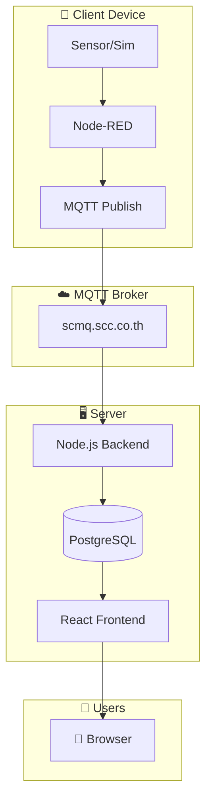
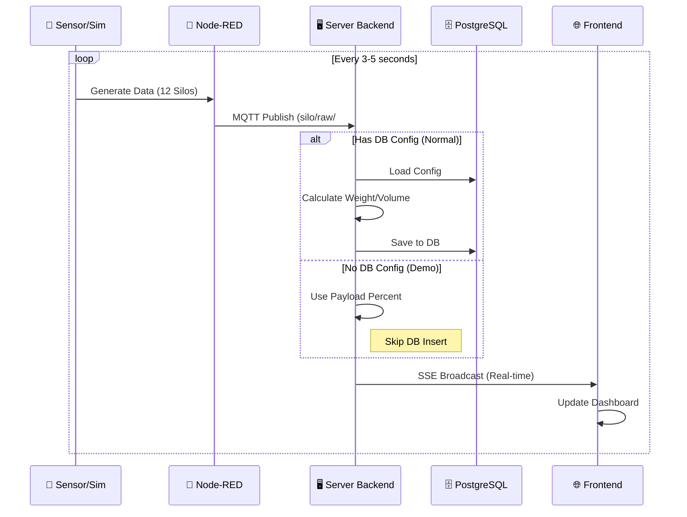
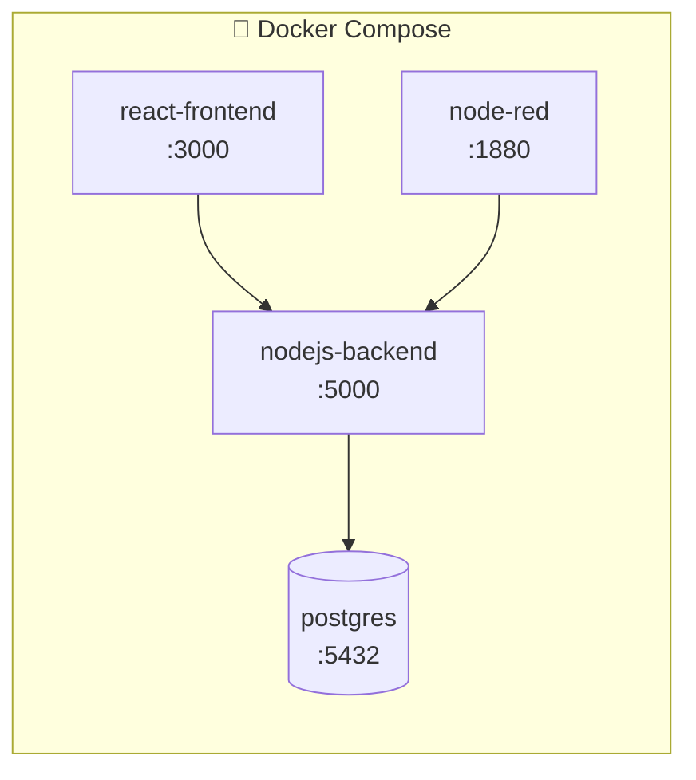

# 🏭 Silo Monitoring System

ระบบตรวจสอบระดับวัตถุดิบในไซโลแบบ Real-time พร้อมหน้าจอแสดงผลที่สวยงามและรายงานที่ครบครัน (รองรับ Demo Mode)


---

## 📋 สารบัญ

- [ภาพรวมระบบ](#-ภาพรวมระบบ)
- [สถาปัตยกรรม](#-สถาปัตยกรรม)
- [การติดตั้ง](#-การติดตั้ง)
- [การใช้งาน](#-การใช้งาน)
- [โครงสร้างโปรเจค](#-โครงสร้างโปรเจค)

---

## 🎯 ภาพรวมระบบ

ระบบ Silo Monitoring ประกอบด้วย 2 ส่วนหลัก:

| ส่วน              | หน้าที่                                                          |
| ----------------- | ---------------------------------------------------------------- |
| **Client Device** | อ่านค่า Sensor หรือจำลองข้อมูล (Simulate) และส่งข้อมูลผ่าน MQTT  |
| **Server**        | รับข้อมูล, คำนวณ, แสดงผล Dashboard, ออกรายงาน และจัดการ Database |

### ✨ ฟีเจอร์หลัก

- 📊 **Monitor Dashboard** - แสดงสถานะไซโลแบบ Real-time พร้อม Animation (รองรับ 12 ไซโล)
- 🎮 **Demo Mode** - ทำงานได้ทันทีแม้ไม่มี Database Config (ใช้ค่า Percent จาก Payload โดยตรง)
- 📈 **Custom Report** - สร้างรายงานตามช่วงเวลา ส่งออกเป็น PDF/CSV
- 🔔 **Notification** - แจ้งเตือนเมื่อระดับผิดปกติ
- ⚙️ **Settings** - ตั้งค่าไซโล, วัตถุดิบ, ผู้ใช้งาน

---

## 🏗 สถาปัตยกรรม

### System Overview




### Data Flow & Logic

ระบบรองรับ 2 โหมดการทำงาน:

1. **Normal Mode**: มี Config ใน Database -> คำนวณค่าและบันทึกลง DB
2. **Demo Mode**: ไม่มี Config ใน Database -> ใช้ค่าจาก Simulation และแสดงผลทันที (ไม่บันทึกลง DB)



### Docker Services



---

## 🚀 การติดตั้ง

### ความต้องการ

- Docker & Docker Compose
- Git

### ขั้นตอน

```bash
# 1. Clone repository
git clone <repository-url>
cd "Silo Monitoring"

# 2. เริ่ม Server
cd Server
docker compose up -d --build

# 3. เริ่ม Client Device (สำหรับ Simulation ข้อมูล)
cd ../Client_device
docker compose up -d
```

### ตรวจสอบสถานะ

```bash
# ดู container ที่รัน
docker ps

# ดู logs ของ backend
docker logs -f nodejs-backend
```

---

## 💻 การใช้งาน

### URLs

| Service         | URL                   | หมายเหตุ    |
| --------------- | --------------------- | ----------- |
| **Frontend**    | http://localhost:3000 | หน้าจอหลัก  |
| **Backend API** | http://localhost:5000 | REST API    |
| **Node-RED**    | http://localhost:1880 | Flow Editor |

### หน้าจอหลัก

| หน้า             | คำอธิบาย                                 |
| ---------------- | ---------------------------------------- |
| `/monitor-beta`  | Dashboard แสดงสถานะ 12 ไซโลแบบ Real-time |
| `/custom-report` | สร้างรายงาน PDF/CSV                      |
| `/notifications` | ดูประวัติการแจ้งเตือน                    |
| `/settings`      | ตั้งค่าระบบ                              |

---

## 📁 โครงสร้างโปรเจค

```
Silo Monitoring/
├── 📂 Server/                    # ฝั่ง Server
│   ├── 📂 backend/               # Node.js API (Express)
│   │   ├── app.js                # Entry point
│   │   ├── mqttSubscriber.js     # Logic รับค่า MQTT, SSE Broadcast
│   │   └── controller/           # API routes
│   ├── 📂 monitor-web/           # React Frontend (Vite/CRA)
│   │   └── src/
│   │       ├── Pages/            # หน้าหลัก
│   │       └── components/       # UI Components
│   ├── 📂 initdb/                # Database schema
│   └── docker-compose.yaml
│
└── 📂 Client_device/             # ฝั่ง Client (Sensor Simulation)
    ├── 📂 backend/               # (Legacy)
    ├── 📂 nodered-flowdir/       # Node-RED flows (Simulation logic)
    └── docker-compose.yml
```

---

## 🔧 Environment Variables

### Server Backend

| Variable      | ค่าตัวอย่าง           | คำอธิบาย        |
| ------------- | --------------------- | --------------- |
| `MQTT_BROKER` | mqtt://scmq.scc.co.th | MQTT broker URL |
| `PG_HOST`     | postgres              | PostgreSQL host |
| `PG_DATABASE` | Silo                  | Database name   |

---

## 📝 License

MIT License - ใช้งานได้อย่างอิสระ

---

## 👨‍💻 Author

Developed with ❤️ for Industrial IoT
